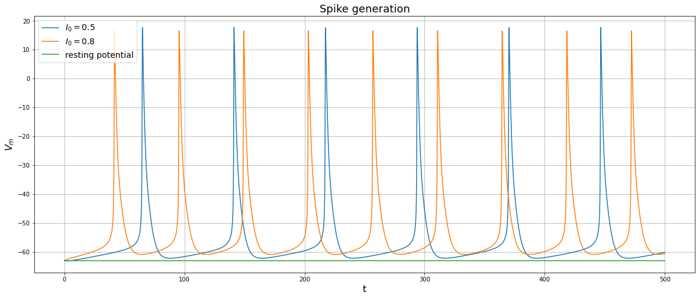
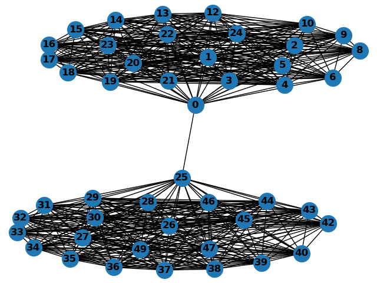
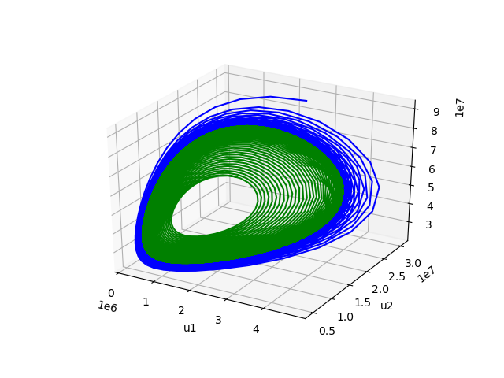
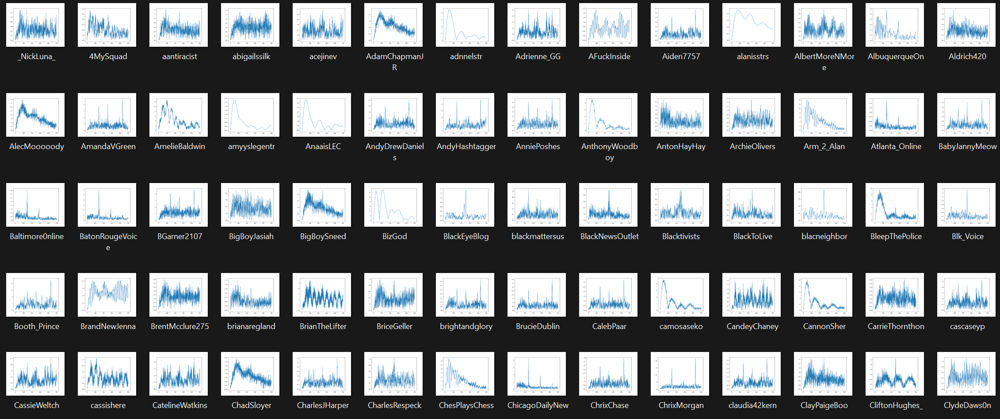

Welcome to my website. My name is Yunong Chen, a master student majored in applied math graduating May 2023. I am currently looking for full time positions on quantitative finance or software engineering starting May 2023. If you are hiring or found a typo, please feel free to email me at yc4011@columbia.edu. Below is an overview of some projects I have done

>>>>>>>
<table class="wide">
<tr>
  <td class="left">
    
  </td>
  <td class="right">
    
  </td>
</tr>
<tr>
  <td class="left">
    
  </td>
  <td class="right">
    
  </td>
</tr>
</table>

  

      <ul class="nav">
          <li><a href="https://github.com/yunongch">see more figures</a></li>
      </ul>
  

