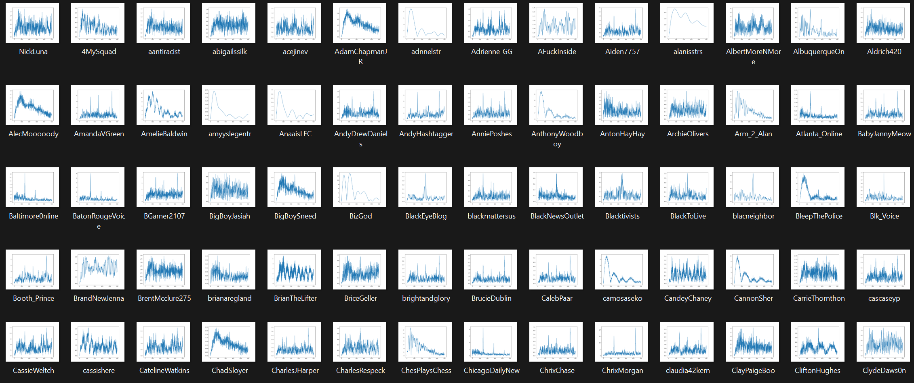

  

      <ul class="nav">
          <li><a href="{{ BASE_PATH }}/assets/broman_cv.pdf">cv</a></li>
          <li><a href="https://github.com/kbroman">github</a></li>
          <li><a href="http://kbroman.org/blog">blog</a></li>
          <li><a href="https://www.linkedin.com/in/benjamin-harvey-ph-d-1928839a/">linkedin</a></li>
      </ul>
  

### Portfolio
<table class="wide">
<tr>
  <td class="left">
    <a href="pages/publpics/bank equation.html">
        <li>
  </td>
  <td class="right">
    <a href="pages/publpics/converge graph.html">
        <li>
  </td>
</tr>
<tr>
  <td class="left">
    <a href="pages/publpics/de.html">
        <li>
  </td>
  <td class="right">
    <a href="pages/publpics/ffts.html">
        <li>
  </td>
</tr>
<tr>
  <td class="left">
    <a href="pages/publpics/Figure_1.html">
        <li>
  </td>
  <td class="right">
    <a href="pages/publpics/Figure_2.html">
        <li>
  </td>
</tr>
<tr>
  <td class="left">
    <a href="pages/publpics/mfdfa.html">
        <li>
  </td>
  <td class="right">
    <a href="pages/publpics/spike.html">
        <li>
  </td>
</tr>

  

      <ul class="nav">
          <li><a href="index.html">back</a></li>
      </ul>
  

